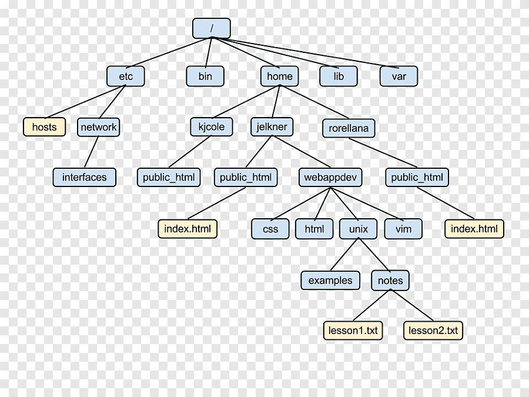
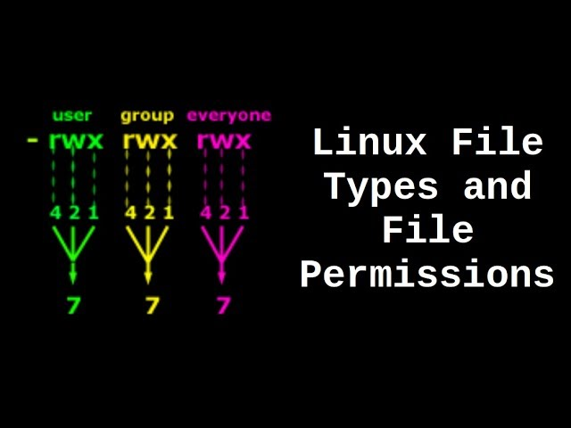

# Comandos de UNIX

## Conexión

`ssh user@host` : nos conectamos como "usuario" a la máquina "host".

- `-p puerto` : especifica el puerto por el que nos conectaremos a la máquina

`exit` : sale de la sesión

## Ficheros

`touch fich.txt` : crea el fichero "fich.txt"

> [!IMPORTANT]
> El nombre de los ficheros puede contener cualquier carácter menos: `*`, `?`, `[`, `]`, `'`, `"`, `` ` ``, `^`, `|`. En general no se permite un carácter ASCII menor a 32 y superior a 127. 

Los ficheros no tienen una norma general, pero lo normal es que los archivos de tipo C lleven la extensión `.c` al final, los de texto `.txt`... Los ficheros invisibles son los que llevan un `.` al principio del nombre, como `.fichero_oculto.txt`

Los ficheros se organizan en <u>**directorios**</u>, que son estructuras que contienen ficheros y otros directorios a su vez.

La organización de ficheros en UNIX se ve tal que así : 



Siendo `/` el directorio <u>**raíz**</u>/<u>**padre**</u> del que cuelgan los demás directorios (<u>**hijos**</u>)

- **Directorio actual de trabajo** $\rightarrow{}$ es el directorio actual en el que se encuentra el usuario. Nos referimos a él con un punto : `./`, y para referirnos al padre lo hacemos con dos puntos : `../`
- **Directorio HOME** $\rightarrow{}$ es la forma genérica de referirse al directorio asignado a cada usuario de la máquina (y es distinto para cada uno)

> [!NOTE]
> En directorios distintos puede haber ficheros/barra directorios con el mismo nombre, por lo que sólo el nombre no es un identificador único, hay que distinguir dos tipos de rutas : 

- **Ruta absoluta** $\rightarrow{}$ parte del directorio raíz y se especifican todos los directorios por los que pasamos hasta el fichero/directorio destino : `/home/iannand/Escritorio/prueba.txt`
- **Ruta relativa** $\rightarrow{}$ igual que antes pero partiendo del directorio de trabajo actual. Suponiendo que estemos en /home/iannand : `Escritorio/prueba.txt` 

## Directorios

`cd destino` : cambia al directorio "destino". Podemos retroceder al directorio padre poniendo `../`

`ls` : muestra el contenido de un directorio

- `-a` : muestra además los archivos/directorios ocultos del directorio
- `-l` : muestra información más detallada y organizada del contenido de un directorio

`mkdir dir` : crea el directorio "dir" 

- `-p dir1/dir2/dir3` : crea la estructura completa incluso si no existen ni dir1 ni dir2.

```
dir1
  \
   \
    dir2
      \
       \
        dir3
```

`rmdir dir` : borra el directorio "dir"

> [!IMPORTANT]
> El directorio debe estar vacío

`pwd` : muestra la ruta absoluta al directorio actual

`cat fich.txt` : muestra el contenido de un fichero. Sólo válido para ficheros de texto (.mp3, .png, ... NO; .txt, .java, .py, ... SI)

`rm fich.txt` : elimina un archivo

- `-r` : con la opción -r podemos borrar también directorios

> [!CAUTION]
> rm es peligroso, lo que se borra no se recupera. La opción -r borra TODO lo que haya dentro del directorio. Hay que tener cuidado.

`file fich.txt` : muestra el tipo de archivo que es fich.txt.

`cp origen/fich_origen destino/fich_destino` : copia ficheros. Jugando con el comando, podemos cambiar de directorio, de nombre y de directorio o solo el nombre (es como copiar en windows).

`cmp fich1 fich2` : compara dos ficheros (si no muestra nada es que son iguales)

`mv origen/fich_origen destino/fich_destino` : similar al comando "cp", pero en vez de copiar y pegar, este comando **corta** y pega.

`ln origen destino` : crea un enlace entre un archivo/directorio origen y otro destino. Es similar a copiar, solo que al copiar generamos un archivo nuevo igual al original y al enlazar sólo creamos un nombre, por lo que todos los cambios que ocurran en el origen se ven reflejados en el destino. Es similar al concepto de acceso directo en Windows.

`chmod` : cambia los permisos de un fichero/directorio.

- `r` (permiso de lectura) : si está activado, puede verse el contenido del fichero
- `w` (permiso de escritura) : si está activado, se puede modificar/borrar el fichero
- `x` (permiso de ejecución) : si está activado, el fichero puede ser ejecutado

Veamos ahora sobre quién podemos efectuar estos permisos : 

- `u` (propietario) : nosotros mismos
- `g` (grupo) : sobre los usuarios que pertenezcan al mismo grupo que el usuario
- `o` (otros) : aquellos usuarios que no sean ni nosotros mismos ni pertenezcan al mismo grupo
- `a` : TODOS los usuarios

Podemos asignar o quitar permisos a los usuarios mediante los operandos `+` y `-`

```sh
chmod u+x fich # el usuario puede ejecutar el fichero
chmod g-w fich # el grupo NO puede modificar/borrar el fichero
chmod ug+rw fich # el usuario y el grupo pueden leer y modificar/borrar el fichero
chmod u+w,go-w fich # el usuario puede modificar/borrar el archivo y el grupo y otros ya no
```

Para usar el modo octal en chmod, usaremos potencias de dos, la lectura representa $2^2=4$, la escritura $2^1=2$, y la ejecución $2^0=1$. Si queremos que el permiso esté activado multiplicamos por 1, y si queremos que NO esté activado, multiplicamos por 0. Hacemos esto tanto para el usuario, el grupo y otros, y una vez tengamos el resultado de cada uno, los agrupamos de izquierda a derecha.



Por ejemplo, si queremos que el permiso de un fichero quede tal que así : 

```
-r-x|rw-|rwx
 101|110|111
  5 | 6 | 7
     567
```

tendríamos que hacer `chmod 567 fich.txt`

`man comando` : muestra ayuda sobre un comando (también muestra ayuda sobre funciones del lenguaje C)

`passwd` : permite cambiar la contraseña del usuario

`who` : muestra información de quién está conectado a la máquina y de sus sesiones de trabajo.

- `who am i` : muestra el nombre completo del usuario e información de las sesiones de trabajo abiertas

`date` : muestra información de la fecha del sistema

`echo "Mensaje"` : muestra el mensaje por pantalla